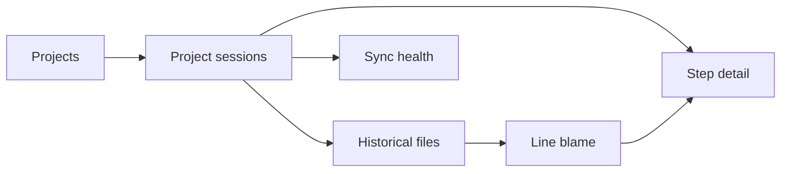

# UI information architecture and wireframes

Status: proposed

Issue: #47

Primary test project: `girlfriend-assistant`

## Product hierarchy



The hierarchy follows re_gent's domain rather than Git hosting conventions:

- A **project** is one server repository id.
- A **session** is one agent activity stream/ref.
- A **step** is one immutable recorded turn with conversation and causes.
- A **file** is always viewed at a selected step/tree, never as an unexplained
  mutable latest version.
- **Blame** attributes each line to a step and links back to that step's full
  context.

## Routes

| Route | Purpose |
|---|---|
| `/projects` | Discover projects available to the current server/user. |
| `/projects/:projectId` | Redirect to the project's session history. |
| `/projects/:projectId/sessions` | Filterable session list in canonical activity order. |
| `/projects/:projectId/sessions/:sessionId` | Session timeline. |
| `/projects/:projectId/steps/:stepHash` | Complete conversation, causes, effects, usage, and changed files. |
| `/projects/:projectId/steps/:stepHash/files` | Historical tree at one step. |
| `/projects/:projectId/steps/:stepHash/files/*` | File content with optional blame gutter. |

Project, session, step, and file selections are URL state so every investigation
can be copied, reopened, and reviewed. Filters use search parameters.

## Desktop shell

```text
┌────────────────────────────────────────────────────────────────────────────┐
│ r  re_gent   girlfriend-assistant / sessions        Search   ● Connected │
├─────────────────┬──────────────────────────────────────────────────────────┤
│ Project         │ Sessions                         Branch: main   Filter   │
│ girlfriend-     ├──────────────────────────────────────────────────────────┤
│ assistant    ▾  │ Today                                                   │
│                 │                                                         │
│ ● Sessions      │ SL  Refine reminder scheduling                         │
│   Step context  │     Shay · 2m       Codex   gpt-5.6        42 steps  › │
│   Files & blame │ ─────────────────────────────────────────────────────── │
│                 │ AA  Add relationship context                            │
│ Server          │     Arad · 18m      Claude  Sonnet         28 steps  › │
│ localhost:7654  │                                                         │
│ Self-hosted     │ Yesterday                                               │
│                 │ AL  Document onboarding prompt                          │
│                 │     Amir · 1h       Codex   gpt-5.6         9 steps  › │
└─────────────────┴──────────────────────────────────────────────────────────┘
```

The top bar owns deployment/server context and project selection. The left rail
owns project-local navigation. Screen-local filters and display controls stay
inside the content area. The project's primary screen is its history, not a
dashboard of counts already visible in that history.

## Session and step flow

```text
┌ Sessions ──────────────────────────────────────────────────────────────────┐
│ Canonical activity order                                      Newest first │
├────────────────────────────────────────────────────────────────────────────┤
│ ● Refine reminder scheduling     Shay · Codex · 42 steps          2m ago  │
│ ● Add relationship context       Arad · Claude · 28 steps         18m ago │
│ ● Document onboarding prompt     Amir · Codex · 9 steps            1h ago │
└────────────────────────────────────────────────────────────────────────────┘

┌ Step 7ac3ef1 ───────────────────────────┬──────────────────────────────────┐
│ Conversation                            │ Tool calls                       │
│                                        │                                  │
│ You                                    │ Edit  parser.ts                  │
│ Make reminders understand natural...  │ Write parser.test.ts             │
│                                        │ Bash  pnpm test parser           │
│ Assistant                              │                                  │
│ I'll separate parsing from ...         │ Changed files                    │
│                                        │ src/reminders/parser.ts          │
│ Reasoning (visually secondary)         │ src/reminders/parser.test.ts     │
└────────────────────────────────────────┴──────────────────────────────────┘
```

Tool calls retain conversation order when the API provides it. Reasoning is
available but visually secondary and can be collapsed. Large args/results are
collapsed with an explicit byte count; they are never injected as raw HTML.

## Historical file and blame flow

```text
┌ Tree ───────────────┬ parser.ts at 7ac3ef1 ────────────────────────────────┐
│ ▾ src               │  12  3be208d │ export function parseReminder(       │
│   ▾ reminders       │  13  7ac3ef1 │   input: string, timezone: string    │
│     parser.ts       │  14  7ac3ef1 │ ): ZonedReminder {                  │
│     parser.test.ts  │  15  3be208d │   const parsed = chrono.parseDate…  │
│   app.ts            │  16  7ac3ef1 │   return inTimezone(parsed, timezone)│
└─────────────────────┴──────────────────────────────────────────────────────┘
```

Selecting a blame hash opens its step while preserving the return path to the
same file and line. On narrow screens the tree becomes a separate route/drawer,
and the code pane keeps horizontal scrolling inside itself rather than forcing
the whole application to scroll.

## Mobile shell

```text
┌──────────────────────────────────┐
│ r re_gent          ● Connected  │
│ girlfriend-assistant         ▾  │
├──────────────────────────────────┤
│ Sessions  Step context  Files → │
├──────────────────────────────────┤
│ Sessions       main ▾   Filter  │
│                                  │
│ Today                            │
│ SL  Refine reminder scheduling  │
│     Shay · 2m                    │
│     Codex · gpt-5.6 · 42 steps  │
│ ──────────────────────────────── │
│ AA  Add relationship context    │
│     Arad · 18m                   │
│     Claude · Sonnet · 28 steps  │
└──────────────────────────────────┘
```

- The project selector occupies its own top-bar row.
- Project navigation becomes a horizontally scrollable tab list.
- Two-column step/file layouts stack; primary context appears before metadata.
- Tables become semantic card-like rows only when their columns cannot remain
  readable.
- Touch targets are at least 44 CSS pixels and keyboard focus remains visible.

## Required states

Every data route implements the following states before it is considered done:

| State | Behavior |
|---|---|
| Initial loading | Preserve the page shell and reserve the final layout; do not replace the whole app with a spinner. |
| Background refresh | Keep current data visible and show a quiet freshness indicator. |
| Empty server | Explain that no projects exist and give the exact `rgt connect`/recording next step appropriate to the deployment. |
| Empty project | Project exists but has no session refs; do not claim history is waiting. |
| Partial legacy data | Render the step and label missing conversation/author fields without hiding other data. |
| Unauthorized | Managed/enterprise login or access request; never present this as a missing project. |
| Forbidden | Name the inaccessible project only when policy permits it. |
| Offline/unreachable | Keep cached screen data when available and show when it was last refreshed. |
| Not found | Distinguish project, session, step, and file absence with a safe route back. |
| Oversized/binary file | Show metadata and a safe download action only when authorized; do not attempt text rendering. |

## Visual direction

- Use [Entire](https://entire.io/) as the hierarchy reference: a dense history
  surface with repository context, search, filters, and scan-friendly rows.
- Use [AI CSS](https://www.aicss.dev/) and [Beautiful
  UI](https://www.beautifului.dev/) as component-craft references for agent
  messages, reasoning, tools, diffs, code, and task state.
- re_gent is a developer history tool, not a marketing or metrics dashboard.
  Prefer flat rows, dividers, gutters, and whitespace over nested cards.
- re_gent purple marks provenance and selection. Green, amber, and red remain
  semantic; neutral surfaces carry most of the interface.
- System sans for interface text; monospace only for hashes, ids, paths, tools,
  and source code.
- Light and dark themes share the same hierarchy and meet WCAG 2.2 AA contrast.
- Avoid decorative metrics, gradients, oversized icons, and fictional status.
  Every visible value must be returned by the API or be clearly derived from it.

## Storybook review contract

The foundation is approved as components before routes are assembled. The
initial review matrix is:

- `AppShell`: desktop, narrow, long project name, disconnected.
- `SessionRow`: Codex, Claude, OpenCode, missing author/model, long title.
- `SessionList`: populated, loading, empty, unreachable.
- `StepTrace`: prompt, assistant, collapsed reasoning, expanded tools, failed
  tool, partial legacy data.
- `FileChangeRow`: added, modified, deleted, renamed, binary.
- `CodeViewer` and `BlameGutter`: selected provenance, missing provenance,
  long lines, empty file, oversized file.
- Feedback components in light and dark themes.

Stories are the visual, interaction, responsive, and accessibility review gate.
Only approved variants are consumed by product routes.
